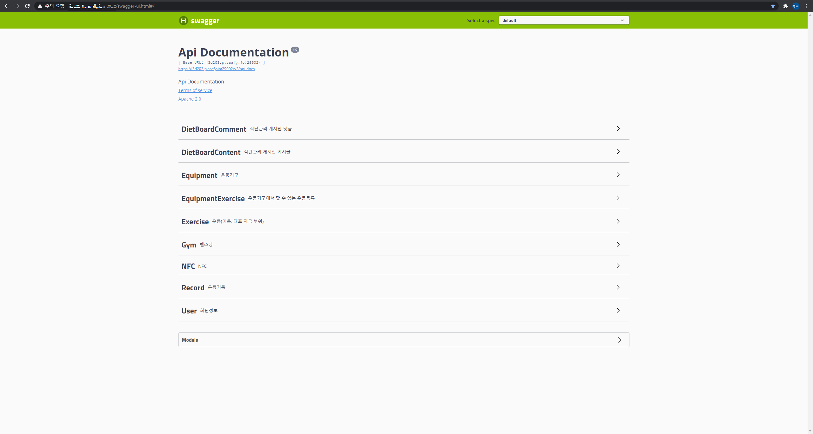

# Hellog Backend Application

## 발표용 자료는 아래를 참조하세요.

<a href="#">발표용 자료 확인</a>

## 로컬에서 헬로그 백엔드를 실행하는 법

Hellog Backend는 [메이븐](https://spring.io/guides/gs/maven/) 프로젝트로 구성된 [스프링 부트](https://spring.io/guides/gs/spring-boot) 어플리케이션입니다. 클론한 프로젝트에 일부 구성물을 추가한 후 메이븐 패키지를 통해 .jar 파일을 빌드하여 커맨드 라인에서 다음과 같이 실행합니다.

```
$ git clone https://github.com/syureu/Hellog2.git
```

몇 가지 파일은 보안상의 이유로 깃에 기록되지 않았습니다.

- Hellog2/backend/src/main/resources/\*.p12

SSL 인증서 입니다.

- Hellog2/backend/src/main/resources/application.properties

부트 어플리케이션 설정파일에는 ssl의 비밀번호, 암호화방법, DB의 주소, DB 계정 및 비밀번호 등이 노출되기 때문에 깃 프로젝트에 담겨 있지 않습니다. 아래의 내용을 작성하여 파일을 추가해주세요.

```
server.port={Port}
server.ssl.enabled=true
server.ssl.key-store={SSL KEY File Path.p12}
server.ssl.key-store-password={SSL KEY Password}
server.ssl.key-store-type={SSL KEY Type}
server.ssl.key-alias={SSL KEY Alias}

spring.jackson.time-zone={Timezone}

spring.datasource.driver-class-name=com.mysql.cj.jdbc.Driver
spring.datasource.url={Database URL}
spring.datasource.username={Database User}
spring.datasource.password={Database Password}

mybatis.type-aliases-package=com.ssafy.pjt1track3
mybatis.mapper-locations=classpath:mappers/*.xml

spring.jpa.hibernate.ddl-auto=none
spring.jpa.database-platform=org.hibernate.dialect.MySQL8Dialect
```

위 두 파일을 작성한 이후 다음과 같이 .jar파일을 빌드 후 실행할 수 있습니다.

```
$ cd Hellog2/backend
$ mvn package
$ java -jar target/*.jar
```

프로젝트는 다음 경로에서 실행됩니다 : [https://localhost:port/](https://localhost:port/)

백엔드는 RESTFUL API 구조를 가지고 있기 때문에 경로접속을 통해 프로젝트 관련 내용을 확인하고 싶다면 제공되고 있는 [Swagger](https://localhost:port/swagger-ui.html) 페이지를 방문하시면 됩니다.



## 버그와 이슈를 발견하신다면 제보해 주시면 감사하겠습니다.

이슈 트래커 주소 : [https://github.com/syureu/Hellog2/issues](https://github.com/syureu/Hellog2/issues)

## 데이터베이스 설정

In its default configuration, Petclinic uses an in-memory database (H2) which
gets populated at startup with data. The h2 console is automatically exposed at `http://localhost:8080/h2-console`
and it is possible to inspect the content of the database using the `jdbc:h2:mem:testdb` url.

A similar setup is provided for MySql in case a persistent database configuration is needed. Note that whenever the database type is changed, the app needs to be run with a different profile: `spring.profiles.active=mysql` for MySql.

You could start MySql locally with whatever installer works for your OS, or with docker:

```
docker run -e MYSQL_USER=petclinic -e MYSQL_PASSWORD=petclinic -e MYSQL_ROOT_PASSWORD=root -e MYSQL_DATABASE=petclinic -p 3306:3306 mysql:5.7.8
```

Further documentation is provided [here](https://github.com/spring-projects/spring-petclinic/blob/main/src/main/resources/db/mysql/petclinic_db_setup_mysql.txt).

## 각자의 IDE에 셋팅하기

### 필수 요소

다음의 환경이 당신의 환경에 설치되어있어야 합니다 :

- Java 11 혹은 그 이상 버전
- git command line tool (https://help.github.com/articles/set-up-git)
- Your preferred IDE
  - Eclipse with the m2e plugin. Note: when m2e is available, there is an m2 icon in `Help -> About` dialog. If m2e is
    not there, just follow the install process here: https://www.eclipse.org/m2e/
  - [Spring Tools Suite](https://spring.io/tools) (STS)
  - IntelliJ IDEA
  - [VS Code](https://code.visualstudio.com)

### 따라해보기 :

1. On the command line
   ```
   git clone https://github.com/syureu/Hellog2.git
   ```
2. Inside Eclipse or STS

   ```
   File -> Import -> Maven -> Existing Maven project
   ```

   Then either build on the command line `./mvnw generate-resources` or using the Eclipse launcher (right click on project and `Run As -> Maven install`) to generate the css. Run the application main method by right clicking on it and choosing `Run As -> Java Application`.

3. Inside IntelliJ IDEA
   In the main menu, choose `File -> Open` and select the Petclinic [pom.xml](pom.xml). Click on the `Open` button.

   CSS files are generated from the Maven build. You can either build them on the command line `./mvnw generate-resources` or right click on the `pjt1track3` project then `Maven -> Generates sources and Update Folders`.

   A run configuration named `Pjt1track3Application` should have been created for you if you're using a recent Ultimate version. Otherwise, run the application by right clicking on the `Pjt1track3Application` main class and choosing `Run 'Pjt1track3Application'`.

4. Navigate to Hellog Backend Application Swagger

   Visit [https://localhost:port/swagger-ui.html](https://localhost:port/swagger-ui.html) in your browser.

## 상세히 보기

| Spring Boot Configuration     | Class or Java property files                                                                                                                        |
| ----------------------------- | --------------------------------------------------------------------------------------------------------------------------------------------------- |
| The Main Class                | [Pjt1track3Application](https://github.com/syureu/Hellog2/blob/dev-back/backend/src/main/java/com/ssafy/pjt1track3/Pjt1track3Application.java)      |
| Spring Security Configuration | [SecurityConfiguration](https://github.com/syureu/Hellog2/blob/dev-back/backend/src/main/java/com/ssafy/pjt1track3/auth/SecurityConfiguration.java) |
| MyBatis Configuration         | [DatabaseConfig](https://github.com/syureu/Hellog2/blob/dev-back/backend/src/main/java/com/ssafy/pjt1track3/config/DatabaseConfig.java)             |
| Swagger Configuration         | [SwaggerConfig](https://github.com/syureu/Hellog2/blob/dev-back/backend/src/main/java/com/ssafy/pjt1track3/config/SwaggerConfig.java)               |

# 기획, 요구사항 명세서, ERD, DB Scheme, DDL

# License

The Hellog Backend application is released under version 2.0 of the [Apache License](https://www.apache.org/licenses/LICENSE-2.0).
