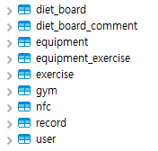
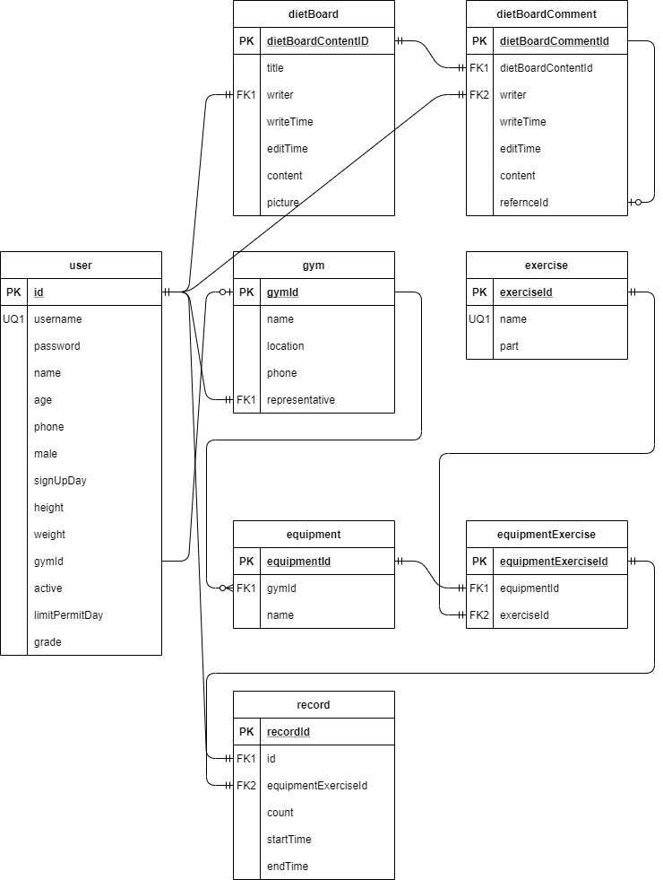
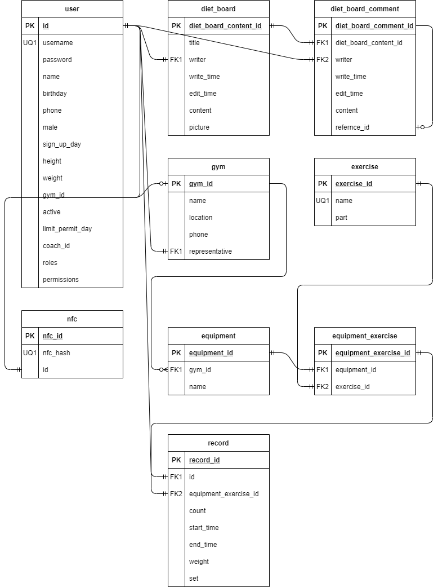

# Hellog Backend Application

## 발표용 자료는 아래를 참조하세요.

<a href="#">발표용 자료 확인</a>

## 로컬에서 헬로그 백엔드를 실행하는 법

Hellog Backend는 [메이븐](https://spring.io/guides/gs/maven/) 프로젝트로 구성된 [스프링 부트](https://spring.io/guides/gs/spring-boot) 어플리케이션입니다. 클론한 프로젝트에 일부 구성물을 추가한 후 메이븐 패키지를 통해 .jar 파일을 빌드하여 커맨드 라인에서 다음과 같이 실행합니다.

```
$ git clone https://github.com/syureu/Hellog2.git
```

몇 가지 파일은 보안상의 이유로 깃에 기록되지 않았습니다.

- Hellog2/backend/src/main/resources/\*.p12

SSL 인증서 입니다.

- Hellog2/backend/src/main/resources/application.properties

부트 어플리케이션 설정파일에는 ssl의 비밀번호, 암호화방법, DB의 주소, DB 계정 및 비밀번호 등이 노출되기 때문에 깃 프로젝트에 담겨 있지 않습니다. 아래의 내용을 작성하여 파일을 추가해주세요.

```
server.port={Port}
server.ssl.enabled=true
server.ssl.key-store={SSL KEY File Path.p12}
server.ssl.key-store-password={SSL KEY Password}
server.ssl.key-store-type={SSL KEY Type}
server.ssl.key-alias={SSL KEY Alias}

spring.jackson.time-zone={Timezone}

spring.datasource.driver-class-name=com.mysql.cj.jdbc.Driver
spring.datasource.url={Database URL}
spring.datasource.username={Database User}
spring.datasource.password={Database Password}

mybatis.type-aliases-package=com.ssafy.pjt1track3
mybatis.mapper-locations=classpath:mappers/*.xml

spring.jpa.hibernate.ddl-auto=none
spring.jpa.database-platform=org.hibernate.dialect.MySQL8Dialect
```

위 두 파일을 작성한 이후 다음과 같이 .jar파일을 빌드 후 실행할 수 있습니다.

```
$ cd Hellog2/backend
$ mvn package
$ java -jar target/*.jar
```

프로젝트는 다음 경로에서 실행됩니다 : [https://localhost:port/](https://localhost:port/)

백엔드는 RESTFUL API 구조를 가지고 있기 때문에 경로접속을 통해 프로젝트 관련 내용을 확인하고 싶다면 제공되고 있는 [Swagger](https://localhost:port/swagger-ui.html) 페이지를 방문하시면 됩니다.


## 버그와 이슈를 발견하신다면 제보해 주시면 감사하겠습니다.

이슈 트래커 주소 : [https://github.com/syureu/Hellog2/issues](https://github.com/syureu/Hellog2/issues)

## 데이터베이스 설정

Hellog Backend Application은 mariadb 10.5.5를 기준으로 작성되었습니다. 다음과 같은 RDB가 필요합니다.


자세한 DDL은 아래의 [DDL](#DDL)을 참조해 주세요.

## 각자의 IDE에 셋팅하기

### 필수 요소

다음의 환경이 당신의 환경에 설치되어있어야 합니다 :

- Java 11 혹은 그 이상 버전
- git command line tool (https://help.github.com/articles/set-up-git)
- Your preferred IDE
  - Eclipse with the m2e plugin. Note: when m2e is available, there is an m2 icon in `Help -> About` dialog. If m2e is
    not there, just follow the install process here: https://www.eclipse.org/m2e/
  - [Spring Tools Suite](https://spring.io/tools) (STS)
  - IntelliJ IDEA
  - [VS Code](https://code.visualstudio.com)

### 따라해보기 :

1. On the command line
   ```
   git clone https://github.com/syureu/Hellog2.git
   ```
2. Inside Eclipse or STS

   ```
   File -> Import -> Maven -> Existing Maven project
   ```

   Then either build on the command line `./mvnw generate-resources` or using the Eclipse launcher (right click on project and `Run As -> Maven install`) to generate the css. Run the application main method by right clicking on it and choosing `Run As -> Java Application`.

3. Inside IntelliJ IDEA
   In the main menu, choose `File -> Open` and select the Petclinic [pom.xml](pom.xml). Click on the `Open` button.

   CSS files are generated from the Maven build. You can either build them on the command line `./mvnw generate-resources` or right click on the `pjt1track3` project then `Maven -> Generates sources and Update Folders`.

   A run configuration named `Pjt1track3Application` should have been created for you if you're using a recent Ultimate version. Otherwise, run the application by right clicking on the `Pjt1track3Application` main class and choosing `Run 'Pjt1track3Application'`.

4. Navigate to Hellog Backend Application Swagger

   Visit [https://localhost:port/swagger-ui.html](https://localhost:port/swagger-ui.html) in your browser.

## 상세히 보기

| Spring Boot Configuration     | Class or Java property files                                                                                                                        |
| ----------------------------- | --------------------------------------------------------------------------------------------------------------------------------------------------- |
| The Main Class                | [Pjt1track3Application](https://github.com/syureu/Hellog2/blob/dev-back/backend/src/main/java/com/ssafy/pjt1track3/Pjt1track3Application.java)      |
| Spring Security Configuration | [SecurityConfiguration](https://github.com/syureu/Hellog2/blob/dev-back/backend/src/main/java/com/ssafy/pjt1track3/auth/SecurityConfiguration.java) |
| MyBatis Configuration         | [DatabaseConfig](https://github.com/syureu/Hellog2/blob/dev-back/backend/src/main/java/com/ssafy/pjt1track3/config/DatabaseConfig.java)             |
| Swagger Configuration         | [SwaggerConfig](https://github.com/syureu/Hellog2/blob/dev-back/backend/src/main/java/com/ssafy/pjt1track3/config/SwaggerConfig.java)               |

# 기획, 요구사항 명세서, DB 스키마, DDL

## 1차 기획 및 요구사항

회원이름 표시

- 기록 페이지 상단에 로그인한 회원의 이름을 표시한다.

회원의 운동기록을 달력에 표시

- 회원이 일 별로 운동한 기록을 달력에 표기 할 수 있게 한다.

회원의 운동기록을 차트와 그래프로 표시

- 회원의 총 운동 볼륨을 일 별로 차트에 표시한다.

헬스장의 기구 사용 기록을 차트로 표시

- 회원들이 사용한 기구를 통계내어 차트로 표시해준다.

트레이너가 회원마다 PT한 기록을 달력에 표시

- 특정 인물의 이름을 달력에 표시하여 PT를 한 것을 표시해준다.

달력 클릭 시 상세화면 표시

- 트레이너, 회원이 달력의 일을 클릭 하거나 자신의 운동을 클릭 하면 상세화면 표시

휴식시간알림

- 세트 종료 후 휴식시간을 알려준다 (2분)

운동프로그램추천

- 부위별 운동 프로그램을 추천해준다

회원의 건강정보

- 신장, 체중, 근육량, 체지방 등 정보 표시

운동기구 별 사용법 표시

- 각 운동기구 별 사용법을 표시한다

-유저의 종류는 관리자(admin), pt코치(coach), 일반회원(user)로 나뉜다. 등급의 역할로도 볼 수 있다. -회원가입이 가능하며 일반회원 가입이 가능하다. -회원은 아이디, 비밀번호, 이름, 나이, 전화번호, 성별, 가입일, 키, 몸무게, 어느 헬스장에 다니는지를
작성해야 가입 가능하다. 가입일은 자동으로 입력되며, 어느 헬스장에 다니는지는 스크롤박스로 선택가능하다. -헬스장을 다니지 않을 수 있으므로 헬스장은 없음 혹은 어떤 헬스장이 선택되도록 한다.

-헬스장의 정보는 이름, 주소, 전화번호, 대표코치(대표 역할)가 있다. -헬스장을 고유 식별하기 위해 내부 관리 번호를 부여한다(int auto increment)

-일반회원이 로그인하면 운동일지, 운동추천, 식단관리 를 볼 수있다. -운동일지는 체지방량지표, 근육량지표, 나의 운동일지 달력을 볼 수 있다. -운동추천은 내 운동 숙련도에 따른 운동법 안내를 받을 수 있다.(백 서버 필요 x) -식단관리 게시판은 로그인하지 않아도 볼 수 있다. -식단관리 게시판에는 여러 인원의 식단이 게시판 형태로 보여진다. -식단관리 게시글에 댓글 작성이 가능하다. 비회원은 댓글 작성할 수 없지만 볼 수는 있다. -식단관리 게시글 댓글에는 depth+1 까지의 대댓글이 가능하다. -회원은 자신이 작성한 댓글에 한해 수정 삭제가 가능하다.

-pt코치로 로그인 시 회원관리, 기구관리, 식단관리 를 볼 수 있다.
-pt코치는 유저와 같으며 어느 헬스장에 소속되었는지에 관한 정보가 추가로 있다. -한 헬스장의 대표역할을 할 경우 헬스장 정보의 대표코치에 등록된다.
-pt코치로 로그인 시 자신의 헬스장에 소속된 회원들의 운동정보를
개인 회원이 보는 것 처럼 볼 수 있다. (체지방, 근육량 지표 및 운동량 달력 정보) -기구관리는 헬스장에 등록된 기구들의 사용량을 볼 수 있다.
-pt코치는 식단 관리 게시판의 글을 작성, 수정, 삭제 가능하다.
-pt코치는 식단관리 게시글에 댓글을 작성, 삭제가 가능하다. -식단관리 게시글의 댓글이 삭제될 때 대댓글이 있다면 댓글의 내용은 지워지고
댓글이 있었다는 흔적만 남게된다. -관리자는 모든 헬스장의 정보를 접근 가능하다. (사이트 관리자 개념) -관리자는 각 헬스장에 관해선 pt 코치와 같은 권한을 가지게 된다.

-식단 관리 게시판의 내용은 식단과 디스크립션으로 작성된다. -식단 게시글 작성시 올리고 싶은 식단이 없으면 식단 추가 메뉴를 이용할 수 있다. -식단은 이름, 칼로리, 영양성분, 작성자, 사진(BLOB등) 등의 정보를 가진다. -식단이 비슷하지만 구분해야할 필요가 있으므로 내부 관리 번호를 가진다.

-iot장비가 계측한 운동량 데이터는 서버로 수신되어 db에 저장된다. -각 회원은 서버로 부터 요청하여 운동량 정보를 수신한다. -체지방량, 근육량 등의 정보도 비슷한 형태로 요청, 응답, 수신하여 출력한다.

-헬스장 운영(대표 pt코치)의 경우 일반 회원으로 가입하고 사이트 관리자에게 헬스장 개설 요청을
할 수 있다. -관리자는 헬스장 개설 요청을 수락하여 헬스장 정보를 만들거나, 혹은 반려 할 수 있다. -관리자는 헬스장을 삭제 가능하며 이 경우 대표코치와 pt코치들은 직위해제되어 일반회원으로 돌아간다 -식단관리 게시판등 이미 코치의 권한으로 작성된 글에 영향이 가지는 않지만 코치의 영향력 행사는 불가능해진다.
-pt코치의 경우 헬스장에 무조건 소속이 되어있어야 하며, 일반 회원이 아닌 pt코치로 소속이 되어야
헬스장의 회원들 정보에 접근 할 수 있다.
-pt코치가 헬스장을 이관할 경우 대표코 치는 각 헬스장의 코치들을 헬스장에서 등록 해제 가능하며,
해제되거나, 이관시 미리 관리자에게 요청하여 타 소속의 헬스장으로 옮길 수 있다.

## 2차 기획 및 요구사항

## 유저

- 유저의 종류는 관리자, 코치, 일반회원으로 나뉜다. 등급의 개념으로 볼 수 있다.
- 회원가입시 일반회원으로 가입된다.
- 회원은 아이디, 비밀번호, 이름, 나이, 전화번호, 성별, 가입일, 키, 몸무게, 소속헬스장, 권한등급 이 있다.
- 소속헬스장은 검색등으로 찾아서 선택하도록 하고 헬스장을 다니지 않는 경우 null로 처리한다.
- pt코치는 소속 헬스장이 무조건 있어야 한다.
- 한 헬스장을 대표하는 pt코치는(관장 혹은 대표) 헬스장의 대표로 상호참조된다.
- 헬스장의 대표가 되는 것은 일반 회원 가입 후 내 정보 메뉴에서 사이트 관리자에게 헬스장 등록 요청을 하여
  관리자가 허가하면 헬스장 정보가 개설되며 헬스장대표 pt코치로 등록 된다.
- 이후 소속된 pt코치들을 등록하려면 일반회원으로 가입하고 헬스장에 pt코치로 신청을하면
  대표 pt코치가 허가하면 해당 헬스장 pt코치로 등록된다.
- 유저 정보가 사라질 시
  -> 체지방량지표, 근육량지표, 운동일지는 삭제된다.
  -> 식단관리게시판 관련 부분은 유지된다.
- 대표pt코치가 사라질 시
  -> 헬스장은 유지된다.

## 헬스장

- 헬스장의 정보는 이름, 주소, 전화번호, 대표코치가 있다.
- 헬스장 정보가 사라질 시
  -> pt코치들은 일반 회원이 된다.
  -> 기구 보유 현황은 삭제된다.
  -> 운동일지는 유지된다. (기구 보유 현황 참조는 원본이 삭제되어도 그대로 두도록 한다.)

## 운동기구

- 운동기구의 등록 메뉴는 사이트 관리자가 볼 수 있고 등록, 수정, 삭제 가능하다.
- 운동기구의 정보로는 기구명, 제조사 가 있다.
- 운동기구 정보 삭제 시
  -> 기구 보유 현황은 유지된다.

## 운동종류

- 운동종류의 등록 메뉴는 사이트 관리자가 볼 수 있고 등록, 수정, 삭제 가능하다.
- 운동종류의 정보로는 운동종류 가 있다.
- 운동종류 정보 삭제 시
  -> 기구 보유 현황은 유지된다.

## 기구 보유 현황

- 기구 보유 현황은 각 헬스장이 어떤 운동기구를 가지고 있는지 나타내는 것이다.
- 각 헬스장이 기기관리 및 iot장비를 통한 서비스를 하기 위해선 기기 보유 현황에 기기를 등록해야한다.
- 기구 보유 현황은 헬스장, 운동기구, 운동종류를 참조하여 등록한다.
- 기구 보유 현황 삭제 시
  -> 운동일지는 유지된다.

## 일반회원 웹 메뉴

- 식단관리는 로그인 하지 않아도 볼 수 있다.
- 일반회원이 로그인하면 운동일지, 운동추천, 식단관리, 내 정보 메뉴를 볼 수 있다.
- 운동일지는 체지방량지표, 근육량지표, 나의 운동일지 달력을 볼 수 있다.
- 운동추천은 내 운동 숙련도를 선택하여 그에 따른 운동법 안내를 받을 수 있다.

## 체지방량지표

- 체지방량지표는 회원의 체지방량지표 데이터이다.
- 아이디(참조), 체지방량, 측정일이 있다.

## 근육량지표

- 근육량지표는 회원의 근육량지표 데이터이다.
- 아이디(참조), 근육량, 측정일이 있다.

## 운동일지 (iot 연관 부분)

- 운동일지는 운동일지 웹 메뉴중 달력의 운동일지 표시용 데이터들이다.
- 아이디(참조), 기구 보유 현황(참조), 카운트 단위(수), 날짜 가 있다.

## 식단관리 게시판

- 식단관리 게시판에는 여러 인원의 식단이 게시판 형태로 보여진다.
- 식단관리 게시글은 회원 이상 작성할 수 있다.(비회원은 작성 불가능)
- 식단관리 게시글은 작성자만 수정 할 수 있다.
- 식단관리 게시글은 작성자 혹은 관리자가 삭제 가능하다.
- 식단관리 게시글의 정보는 작성자, 날짜, 아점저, 게시글, 사진(0~1장) 가 있다.
- 식단관리 게시글에 댓글 작성이 가능하다. (비회원은 작성 불가능)
- 식단관리 게시글의 댓글은 작성자만 수정 할 수 있다.
- 식단관리 게시글의 댓글은 작성자 혹은 관리자가 삭제 가능하다.
- 식단관리 게시글의 댓글에 대댓글을 한 단계까지 작성 가능하다.
- 식단관리 게시글의 대댓글이 있는 댓글을 삭제 시 댓글의 내용은 사라지며 댓글이 있었던 흔적만 남는다.

## pt코치 웹 메뉴

- pt코치로 로그인 시 회원관리, 기구관리, 식단관리, 내 정보 메뉴를 볼 수 있따.
- pt코치는 회원관리에서 자신의 헬스장에 소속된 회원들의 운동일지를 볼 수 있다.
- 기구관리 메뉴에서 헬스장에 등록된 기구들의 사용량을 볼 수 있다.

## 1차 DB 스키마



## 2차 DB 스키마



## DDL

### user table

```
CREATE TABLE `user` (
  `id` bigint(20) NOT NULL AUTO_INCREMENT,
  `username` varchar(255) NOT NULL,
  `password` varchar(255) NOT NULL,
  `name` varchar(255) NOT NULL,
  `birthday` datetime NOT NULL,
  `phone` varchar(255) NOT NULL,
  `male` bit(1) NOT NULL,
  `sign_up_day` datetime NOT NULL DEFAULT current_timestamp(),
  `height` int(11) NOT NULL,
  `weight` int(11) NOT NULL,
  `gym_id` bigint(20) DEFAULT NULL,
  `coach_id` bigint(20) DEFAULT NULL,
  `active` int(11) NOT NULL,
  `limit_permit_day` datetime NOT NULL,
  `roles` varchar(255) DEFAULT NULL,
  `permissions` varchar(255) DEFAULT NULL,
  PRIMARY KEY (`id`),
  UNIQUE KEY `user_UN` (`username`),
  KEY `user_FK` (`coach_id`),
  KEY `user_FK_1` (`gym_id`),
  CONSTRAINT `user_FK` FOREIGN KEY (`coach_id`) REFERENCES `user` (`id`) ON DELETE SET NULL ON UPDATE CASCADE,
  CONSTRAINT `user_FK_1` FOREIGN KEY (`gym_id`) REFERENCES `gym` (`gym_id`) ON DELETE SET NULL ON UPDATE CASCADE,
  CONSTRAINT `user_CHECK` CHECK (octet_length(`username`) >= 4),
  CONSTRAINT `user_CHECK_2` CHECK (octet_length(`username`) <= 16),
  CONSTRAINT `user_CHECK_3` CHECK (`username` regexp '^[A-Za-z0-9+]*$')
) ENGINE=InnoDB AUTO_INCREMENT=24 DEFAULT CHARSET=utf8mb4
```

### gym table

```
CREATE TABLE `gym` (
  `gym_id` bigint(20) NOT NULL AUTO_INCREMENT,
  `name` varchar(255) NOT NULL,
  `location` varchar(255) NOT NULL,
  `phone` varchar(255) NOT NULL,
  `representative` bigint(20) NOT NULL,
  PRIMARY KEY (`gym_id`),
  UNIQUE KEY `gym_UN` (`representative`),
  CONSTRAINT `gym_FK` FOREIGN KEY (`representative`) REFERENCES `user` (`id`) ON DELETE CASCADE ON UPDATE CASCADE
) ENGINE=InnoDB AUTO_INCREMENT=12 DEFAULT CHARSET=utf8mb4
```

### equipment table

```
CREATE TABLE `equipment` (
  `equipment_id` bigint(20) NOT NULL AUTO_INCREMENT,
  `gym_id` bigint(20) NOT NULL,
  `name` varchar(255) NOT NULL,
  PRIMARY KEY (`equipment_id`),
  KEY `equipment_FK` (`gym_id`),
  CONSTRAINT `equipment_FK` FOREIGN KEY (`gym_id`) REFERENCES `gym` (`gym_id`) ON DELETE CASCADE ON UPDATE CASCADE
) ENGINE=InnoDB AUTO_INCREMENT=4 DEFAULT CHARSET=utf8mb4
```

### exercise table

```
CREATE TABLE `exercise` (
  `exercise_id` bigint(20) NOT NULL AUTO_INCREMENT,
  `name` varchar(255) NOT NULL,
  `part` varchar(255) NOT NULL,
  PRIMARY KEY (`exercise_id`)
) ENGINE=InnoDB AUTO_INCREMENT=5 DEFAULT CHARSET=utf8mb4
```

### equipment_exercise table

```
CREATE TABLE `equipment_exercise` (
  `equipment_exercise_id` bigint(20) NOT NULL AUTO_INCREMENT,
  `equipment_id` bigint(20) DEFAULT NULL,
  `exercise_id` bigint(20) NOT NULL,
  PRIMARY KEY (`equipment_exercise_id`),
  KEY `equipment_exercise_FK` (`exercise_id`),
  KEY `equipment_exercise_FK_1` (`equipment_id`),
  CONSTRAINT `equipment_exercise_FK` FOREIGN KEY (`exercise_id`) REFERENCES `exercise` (`exercise_id`) ON UPDATE CASCADE,
  CONSTRAINT `equipment_exercise_FK_1` FOREIGN KEY (`equipment_id`) REFERENCES `equipment` (`equipment_id`) ON DELETE SET NULL ON UPDATE CASCADE
) ENGINE=InnoDB AUTO_INCREMENT=5 DEFAULT CHARSET=utf8mb4
```

### record table

```
CREATE TABLE `record` (
  `record_id` bigint(20) NOT NULL AUTO_INCREMENT,
  `id` bigint(20) NOT NULL,
  `equipment_exercise_id` bigint(20) NOT NULL,
  `sett` int(11) NOT NULL,
  `weight` int(11) NOT NULL,
  `countt` int(11) NOT NULL,
  `start_time` datetime NOT NULL,
  `end_time` datetime NOT NULL,
  PRIMARY KEY (`record_id`),
  KEY `record_FK` (`id`),
  KEY `record_FK_1` (`equipment_exercise_id`),
  CONSTRAINT `record_FK` FOREIGN KEY (`id`) REFERENCES `user` (`id`) ON UPDATE CASCADE,
  CONSTRAINT `record_FK_1` FOREIGN KEY (`equipment_exercise_id`) REFERENCES `equipment_exercise` (`equipment_exercise_id`) ON UPDATE CASCADE
) ENGINE=InnoDB AUTO_INCREMENT=82 DEFAULT CHARSET=utf8mb4
```

### diet_board table

```
CREATE TABLE `diet_board` (
  `diet_board_content_id` bigint(20) NOT NULL AUTO_INCREMENT,
  `title` varchar(255) NOT NULL,
  `writer` bigint(20) NOT NULL,
  `write_time` datetime NOT NULL DEFAULT current_timestamp(),
  `edit_time` datetime DEFAULT NULL,
  `content` varchar(1000) DEFAULT NULL,
  `picture` blob DEFAULT NULL,
  PRIMARY KEY (`diet_board_content_id`),
  KEY `diet_board_FK` (`writer`),
  CONSTRAINT `diet_board_FK` FOREIGN KEY (`writer`) REFERENCES `user` (`id`)
) ENGINE=InnoDB AUTO_INCREMENT=6 DEFAULT CHARSET=utf8mb4
```

### diet_board_content table

```
CREATE TABLE `diet_board_comment` (
  `diet_board_comment_id` bigint(20) NOT NULL AUTO_INCREMENT,
  `diet_board_content_id` bigint(20) NOT NULL,
  `writer` bigint(20) NOT NULL,
  `write_time` datetime NOT NULL DEFAULT current_timestamp(),
  `edit_time` datetime DEFAULT NULL,
  `content` varchar(255) NOT NULL,
  `reference_id` bigint(20) DEFAULT NULL,
  PRIMARY KEY (`diet_board_comment_id`),
  KEY `diet_board_comment_FK_0` (`diet_board_content_id`),
  KEY `diet_board_comment_FK_1` (`reference_id`),
  KEY `diet_board_comment_FK_2` (`writer`),
  CONSTRAINT `diet_board_comment_FK_0` FOREIGN KEY (`diet_board_content_id`) REFERENCES `diet_board` (`diet_board_content_id`) ON DELETE CASCADE,
  CONSTRAINT `diet_board_comment_FK_1` FOREIGN KEY (`reference_id`) REFERENCES `diet_board_comment` (`diet_board_comment_id`),
  CONSTRAINT `diet_board_comment_FK_2` FOREIGN KEY (`writer`) REFERENCES `user` (`id`)
) ENGINE=InnoDB DEFAULT CHARSET=utf8mb4
```

### nfc table

```
CREATE TABLE `nfc` (
  `nfc_id` bigint(20) NOT NULL AUTO_INCREMENT,
  `nfc_hash` varchar(255) NOT NULL,
  `id` bigint(20) DEFAULT NULL,
  PRIMARY KEY (`nfc_id`),
  UNIQUE KEY `nfc_UN` (`nfc_hash`),
  KEY `nfc_FK` (`id`),
  CONSTRAINT `nfc_FK` FOREIGN KEY (`id`) REFERENCES `user` (`id`) ON DELETE SET NULL ON UPDATE CASCADE
) ENGINE=InnoDB AUTO_INCREMENT=2 DEFAULT CHARSET=utf8mb4
```

# License

The Hellog Backend application is released under version 2.0 of the [Apache License](https://www.apache.org/licenses/LICENSE-2.0).
